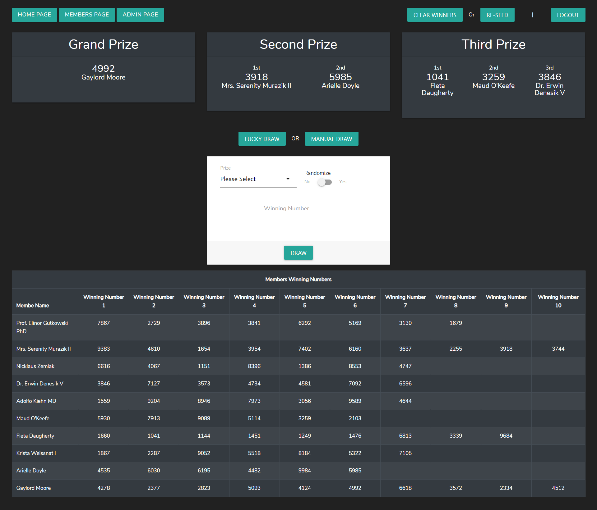
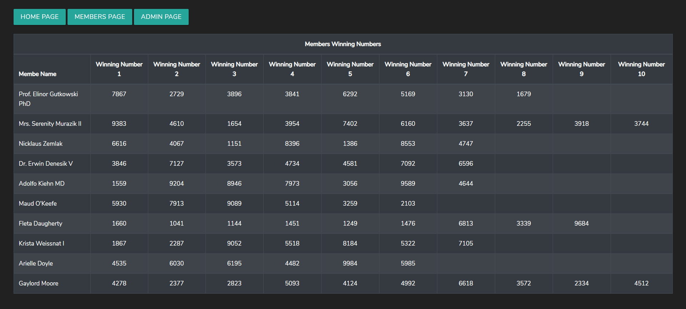

# PLUS 65 TEST CHALLENGE

This is a developer challenge from Plus65 for the Backend developer position.  
[Challenge Requirements](https://drive.google.com/open?id=0ByoKs7KHMtLyeEdrcG5yMnRjUWg5eTlLMUdPbWl0SWxUMVFZ)

## INSTRUCTIONS

1. Clone this repository

> git clone https://github.com/perrymarkg/plus65challenge.git .  

or

> 

2. Copy .env.example to .env
3. Modify the mysql connection variables. In addition you can also modify the ff:

| NAME | Default | Desc |
| ---- | ---- | --- |
| ADMIN_USER | `appadmn` | Admin username
| ADMIN_PASSWORD | `password` | Admin password
| MEMBER_COUNT | 6 | Maximum members generated by the seeder. Max 10
| MIN_WINNING_NO | 6 | Minimum no. of winning numbers by a member
| MAX_WINNING_N0 | 10 | Maximum no. of winning numbers by a member

4. Create your `mysq` `table`
5. Run `composer install`
6. Run `php artisan key:generate`
5. Run `php artisan migrate --seed`

### Sample

Admin  
  

Member  
  
